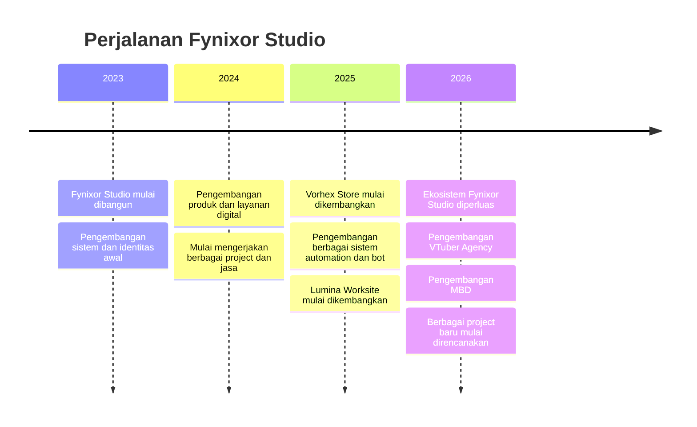

<div align="center">


<br/>

<a href="https://github.com/FynixorStudio">
  
</a>

<br/><br/>


</div>

<br/>

<div align="center">

</div>

<br/>

> *"Bukan tentang seberapa besar sesuatu dimulai, tapi seberapa jauh sesuatu bisa dikembangkan."*
> — Fynixor Studio

<br/>

## 📜 Daftar Isi

<table>
<tr>
<td width="50%">

- [🏛️ Tentang Fynixor Studio](#️-tentang-fynixor-studio)
- [🎯 Visi & Misi](#-visi--misi)
- [🏢 Struktur Fynixor Studio](#-struktur-fynixor-studio)
- [🛒 Vorhex Store](#-vorhex-store)
- [💼 Lumina Worksite](#-lumina-worksite)
- [🎨 VTuber Agency](#-vtuber-agency)

</td>
<td width="50%">

- [🛡️ MBD](#️-mbd)
- [💻 Jasa & Layanan](#-jasa--layanan)
- [🕰️ Linimasa Perjalanan](#️-linimasa-perjalanan)
- [🏆 Pencapaian](#-pencapaian)
- [🛠️ Tech Stack & Tools](#️-tech-stack--tools)
- [📊 Statistik GitHub](#-statistik-github)
- [❓ Pertanyaan Umum](#-pertanyaan-umum)
- [🌐 Kontak & Sosial](#-kontak--sosial)

</td>
</tr>
</table>

---

## 🏛️ Tentang Fynixor Studio

**Fynixor Studio** adalah studio dan ekosistem digital yang menjadi tempat berkembangnya berbagai produk, layanan, dan project dengan bidang yang berbeda.

Fynixor Studio tidak hanya berfokus pada satu jenis produk. Di dalamnya terdapat pengembangan **produk digital, layanan freelance, website, bot, script, automation, cybersecurity, creative project**, serta beberapa bidang lain yang masih dalam tahap perencanaan.

Beberapa nama yang sudah berjalan atau sedang dikembangkan antara lain **Vorhex Store** dan **Lumina Worksite**, sementara project seperti **VTuber Agency**, **MBD**, serta bidang finansial dan trading masih terus dikembangkan sesuai arah Fynixor Studio.

Selain mengembangkan produk sendiri, Fynixor Studio juga menerima pekerjaan dari pihak eksternal seperti **pembuatan website, bot Telegram/WhatsApp, script, automation, dan berbagai kebutuhan programming lainnya**.

```yaml
Entity:              Fynixor Studio
Type:                Digital Studio & Digital Ecosystem
Founder:             Single-Founder
Established:         2023
Based in:            Indonesia 🇮🇩
Main Focus:          Digital Products · Development · Automation · Cybersecurity
Services:            Website · Bot · Script · Programming · Digital Systems
Work Environment:    Android · Windows RDP · Windows Terminal · Server · Cloud
Development:         Internal Projects · Freelance · Commission · Collaboration
Status:              Active & Continuously Developing
```

---

## 🎯 Visi & Misi

<table align="center">
<tr>
<td width="50%" valign="top">

### 🔭 Visi

Membangun ekosistem digital yang dapat berkembang secara bertahap, dengan setiap produk, layanan, dan project memiliki arah serta identitasnya sendiri.

</td>
<td width="50%" valign="top">

### 🧭 Misi

- Mengembangkan produk digital yang dapat digunakan dan dikembangkan dalam jangka panjang
- Membuka layanan development untuk kebutuhan eksternal
- Mengembangkan berbagai project dengan bidang dan karakter yang berbeda
- Menggabungkan development, automation, security, dan kreativitas
- Membuka peluang untuk project dan bidang baru di masa depan

</td>
</tr>
</table>

---

## 🏢 Struktur Fynixor Studio

```mermaid
graph TD
    A["🏛️ Fynixor Studio<br/><sub>Digital Studio & Ecosystem</sub>"] --> B["🛒 Vorhex Store<br/><sub>Digital Products</sub>"]
    A --> C["💼 Lumina Worksite<br/><sub>Freelance & Digital Services</sub>"]
    A --> D["🎨 VTuber Agency<br/><sub>Creative Project</sub>"]
    A --> E["🛡️ MBD<br/><sub>Cybersecurity Project</sub>"]
    A --> F["💻 Development & Services<br/><sub>External & Internal Projects</sub>"]
    A --> G["📊 Future Projects<br/><sub>Projects Under Planning</sub>"]

    B --> B1["Panel"]
    B --> B2["Cloud / RDP"]
    B --> B3["Scripts"]
    B --> B4["SMM / Nokos"]
    B --> B5["Premium Accounts"]

    C --> C1["Website"]
    C --> C2["Bot"]
    C --> C3["Script"]
    C --> C4["Programming"]

    D --> D1["VTuber"]
    D --> D2["Content Creator"]

    E --> E1["Cybersecurity"]
    E --> E2["Security Research"]

    F --> F1["Web Development"]
    F --> F2["Bot Development"]
    F --> F3["Automation"]
    F --> F4["Custom Systems"]

    G --> G1["Trading"]
    G --> G2["Financial Projects"]
    G --> G3["Other Digital Ventures"]

    style A fill:#0a0618,stroke:#8B5CF6,stroke-width:3px,color:#f4f1fa
    style B fill:#1d1533,stroke:#7C3AED,stroke-width:1.5px,color:#f4f1fa
    style C fill:#1b1330,stroke:#8B5CF6,stroke-width:1.5px,color:#f4f1fa
    style D fill:#170f28,stroke:#6D28D9,stroke-width:1.5px,color:#f4f1fa
    style E fill:#221029,stroke:#9333EA,stroke-width:1.5px,color:#f4f1fa
    style F fill:#181027,stroke:#8B5CF6,stroke-width:1.5px,color:#f4f1fa
    style G fill:#130c24,stroke:#6D28D9,stroke-width:1.5px,color:#f4f1fa
```

<div align="center">



</div>

<br/>

<div align="center">

</div>

<br/>

<table align="center">
<tr>
<td align="center" width="33%">
<b>🛒 Vorhex Store</b><br/>
<sub>Digital Products & Marketplace</sub><br/><br/>

</td>
<td align="center" width="33%">
<b>💼 Lumina Worksite</b><br/>
<sub>Freelance & Digital Services</sub><br/><br/>

</td>
<td align="center" width="33%">
<b>🎨 VTuber Agency</b><br/>
<sub>Creative Project</sub><br/><br/>

</td>
</tr>
</table>

---

## 💼 Lumina Worksite

**Punya ide, tapi nggak punya waktu atau kemampuan buat ngerjainnya sendiri?**

Lumina Worksite menjadi jalur Fynixor Studio untuk mengubah kebutuhan digital menjadi sesuatu yang benar-benar bisa digunakan. Mulai dari website sederhana, bot otomatis, script khusus, sampai sistem yang dibuat dari nol sesuai kebutuhan project.

Bukan cuma jual template atau hasil jadi. Setiap project bisa dibangun menyesuaikan **fungsi, alur kerja, dan kebutuhan pengguna**. Mau mulai dari konsep yang masih berantakan atau sudah punya gambaran jelas, keduanya tetap bisa dikerjakan.

Lumina Worksite juga membuka **commission dan freelance project** untuk pihak luar.

**Layanan:** Website · Bot · Script · Programming · Automation · Custom System · Commission

`PHP` `JavaScript` `Node.js` `Python` `Firebase` `MySQL`

---

## 🎨 VTuber Agency

**Belum berjalan bukan berarti belum dimulai.**

VTuber Agency merupakan salah satu project jangka panjang yang sedang dipersiapkan Fynixor Studio. Konsepnya bukan sekadar membuat talent lalu melakukan streaming, tetapi membangun ekosistem yang bisa menjadi tempat talent dan content creator berkembang.

Mulai dari **identitas karakter, visual, konten, hingga kebutuhan teknis**, semuanya masih dalam tahap penyusunan dan pengembangan.

Untuk sekarang, project ini masih berada di balik layar dan **belum dibuka sebagai agency operasional**.

**Fokus:** VTuber · Content Creator · Talent Development · Character · Digital Entertainment

`Illustration` `Live2D` `Streaming` `Content Creation`

---

## 🛡️ MBD

**Di balik sistem yang berjalan, selalu ada kemungkinan sesuatu yang tidak seharusnya terjadi.**

MBD (**Melevolen BlackHeat Division**) merupakan bagian yang digunakan Fynixor Studio untuk mengeksplorasi dunia cybersecurity secara lebih dalam.

Di sini, fokusnya bukan sekadar mencari celah, tetapi memahami **bagaimana sebuah sistem bisa diserang, bagaimana kelemahannya ditemukan, dan bagaimana sistem tersebut dapat dibuat lebih aman**.

MBD mencakup security research, eksperimen, pengembangan security tools, network security, vulnerability research, dan ethical hacking dalam lingkungan yang sesuai.

**Fokus:** Cybersecurity · Security Research · Ethical Hacking · Network Security · Security Tools

`Linux` `Python` `Bash` `Networking` `Cybersecurity`

---

## 💻 Jasa & Layanan

Selain mengembangkan produk internal, Fynixor Studio juga menerima berbagai pekerjaan dari pihak eksternal.

Beberapa layanan yang tersedia:

- 🌐 Pembuatan website
- 🤖 Pembuatan bot Telegram & WhatsApp
- ⚙️ Pembuatan script dan automation
- 💻 Programming & custom system
- 🔥 Firebase integration
- 🗄️ Database & backend development
- 🎨 UI / website interface
- 🔐 Security review & development
- 🛠️ Maintenance dan pengembangan sistem

Project dapat dikerjakan sesuai kebutuhan dan skala pekerjaan.

Fynixor Studio juga terbuka untuk freelance, commission, kerja sama, maupun project jangka panjang.

---

## 🕰️ Linimasa Perjalanan

<div align="center">



</div>

---

## 🏆 Pencapaian

<table align="center">
<tr>
<td align="center" width="25%">

**2023**
<br/>Mulai Dibangun

</td>
<td align="center" width="25%">

**2+**
<br/>Project & Unit Utama

</td>
<td align="center" width="25%">

**Multi-Platform**
<br/>Android · Windows · Server

</td>
<td align="center" width="25%">

**∞**
<br/>Project yang Terus Dikembangkan

</td>
</tr>
</table>

---

## 🛠️ Tech Stack & Tools

<div align="center">

**Languages & Backend**
<br/>


<br/><br/>

**Database & Infrastructure**
<br/>


<br/><br/>

**Automation & Development**
<br/>


</div>

---

## 📊 Statistik GitHub

<div align="center">


<br/>


<br/><br/>


<br/><br/>


</div>

---

## ❓ Pertanyaan Umum

<details>
<summary><b>Apakah Fynixor Studio menerima kerja sama eksternal?</b></summary>
<br/>
Ya. Fynixor Studio terbuka untuk kerja sama, kemitraan, commission, maupun project freelance dari pihak luar, termasuk melalui Fiverr.
</details>

<details>
<summary><b>Apa sebenarnya Fynixor Studio?</b></summary>
<br/>
Fynixor Studio merupakan studio dan ekosistem digital yang menaungi berbagai brand, project, layanan, serta bidang yang sedang dikembangkan. Tidak semua bagian di dalamnya merupakan perusahaan terpisah atau sudah berjalan penuh.
</details>

<details>
<summary><b>Apa saja yang berada di bawah Fynixor Studio?</b></summary>
<br/>
Beberapa bagian yang sedang berjalan atau dikembangkan antara lain Vorhex Store, Lumina Worksite, project VTuber Agency, MBD, serta berbagai project development dan layanan digital lainnya. Bidang baru juga dapat ditambahkan seiring perkembangan Fynixor Studio.
</details>

<details>
<summary><b>Apa itu Vorhex Store?</b></summary>
<br/>
Vorhex Store merupakan platform produk digital yang menyediakan berbagai kebutuhan seperti panel, cloud, RDP, script, SMM, nokos, akun premium murah, dan produk digital lainnya.
</details>

<details>
<summary><b>Apa itu Lumina Worksite?</b></summary>
<br/>
Lumina Worksite merupakan bagian yang berfokus pada pekerjaan dan jasa digital, termasuk pembuatan website, bot, script, programming, automation, desain, serta sistem custom.
</details>

<details>
<summary><b>Apakah Fynixor Studio menyediakan jasa development?</b></summary>
<br/>
Ya. Fynixor Studio menerima berbagai pekerjaan seperti pembuatan website, bot Telegram/WhatsApp, script, automation, backend, database, integrasi API, dan sistem digital sesuai kebutuhan.
</details>

<details>
<summary><b>Apakah Fynixor Studio memiliki VTuber Agency?</b></summary>
<br/>
Ya, tetapi masih dalam tahap persiapan dan pengembangan. Project ini nantinya diarahkan untuk pengelolaan dan pengembangan talent VTuber maupun content creator digital.
</details>

<details>
<summary><b>Apa itu MBD?</b></summary>
<br/>
MBD atau Melevolen BlackHeat Division merupakan bagian yang berfokus pada cybersecurity, ethical hacking, security research, dan pengembangan tools keamanan. MBD juga menjadi ruang untuk riset dan pengembangan kemampuan di bidang cybersecurity.
</details>

<details>
<summary><b>Apakah ada bidang finansial atau trading di Fynixor Studio?</b></summary>
<br/>
Ada rencana untuk mengembangkan bidang tersebut, namun saat ini masih berupa rencana dan belum diposisikan sebagai perusahaan atau unit bisnis yang berjalan penuh. Pengembangan ke depannya dapat mencakup trading, forex, saham, cryptocurrency, maupun sistem finansial digital.
</details>

<details>
<summary><b>Apakah semua sistem Fynixor Studio dibuat dari HP?</b></summary>
<br/>
Tidak. Pengembangan dilakukan menggunakan berbagai lingkungan kerja sesuai kebutuhan, termasuk Android/Termux, RDP Windows, Windows Terminal, server, serta layanan cloud dan tools development lainnya.
</details>

<details>
<summary><b>Apakah Fynixor Studio hanya mengembangkan produk sendiri?</b></summary>
<br/>
Tidak. Selain mengembangkan produk internal, Fynixor Studio juga menerima pekerjaan dari pihak luar melalui freelance, commission, maupun kerja sama langsung.
</details>

<details>
<summary><b>Apakah Fynixor Studio dikerjakan oleh banyak orang?</b></summary>
<br/>
Fynixor Studio saat ini masih berpusat pada founder sebagai pengembang utama. Beberapa project dapat melibatkan pihak lain sesuai kebutuhan, tetapi struktur dan kepemilikan utama tetap berada pada founder.
</details>

<details>
<summary><b>Apakah pengembangan hanya dilakukan menggunakan satu perangkat?</b></summary>
<br/>
Tidak. Fynixor Studio menggunakan beberapa lingkungan kerja sesuai kebutuhan project, seperti Android/Termux, RDP Windows, Windows Terminal, server, GitHub, serta layanan cloud lainnya.
</details>

---

## 🌐 Ketersediaan & Kontak

<div align="center">

| Platform | Status | Tautan |
|----------|--------|--------|
| 💼 Fiverr | 🟢 Aktif | `FynixorStudio` |
| ✉️ Email | 🟢 Terbuka untuk kerja sama | `fynixorstudio@gmail.com` |
| 💬 Telegram | 🟢 Aktif | `@fynixorstudio` |
| 📸 Instagram | 🟢 Aktif | `@fynixorstudio` |

<br/>

<a href="#"></a>
<a href="https://t.me/fynixorstudio"></a>
<a href="#"></a>
<a href="https://instagram.com/fynixorstudio"></a>

</div>

<br/>

<div align="center">

</div>

---

<div align="center">

### 🏛️ Fynixor Studio

*Vorhex Store · Lumina Worksite · VTuber Agency · MBD*

<sub>
Satu nama dengan banyak arah. Setiap unit punya tujuan dan cara kerjanya sendiri,
namun tetap berada di bawah nama Fynixor Studio.
</sub>

<sub>
Beberapa sudah berjalan, beberapa masih disiapkan.
Yang belum ada sekarang, mungkin akan hadir di kemudian hari.
</sub>

<br/><br/>


<sub>© 2026 Fynixor Studio. All rights reserved.</sub>

</div>